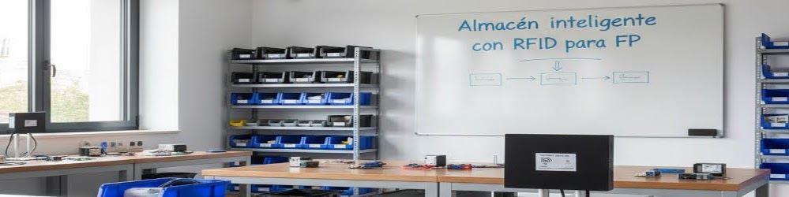
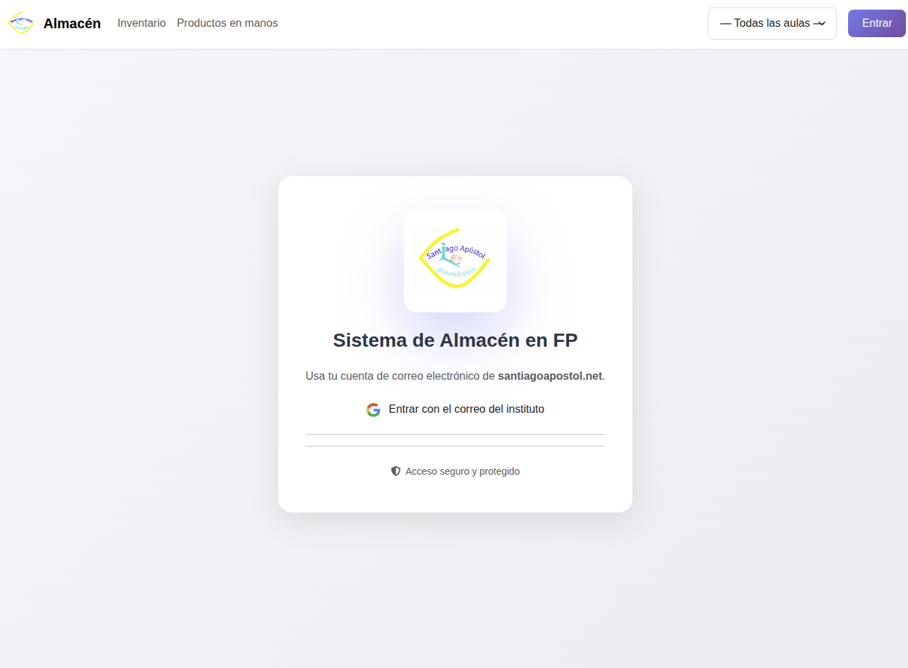
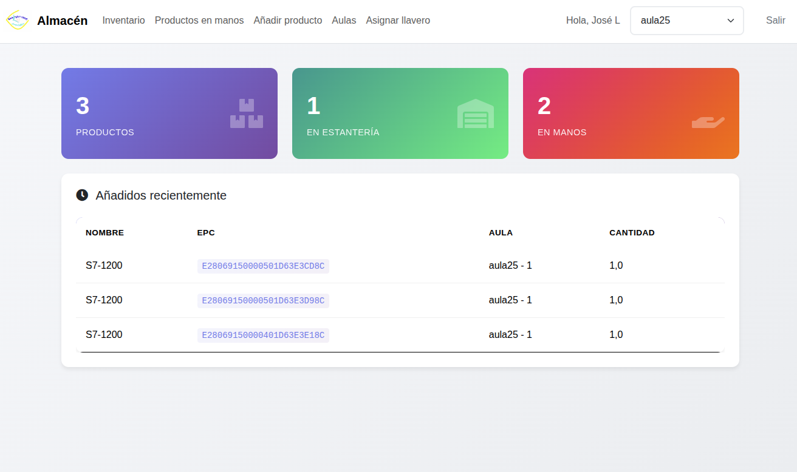
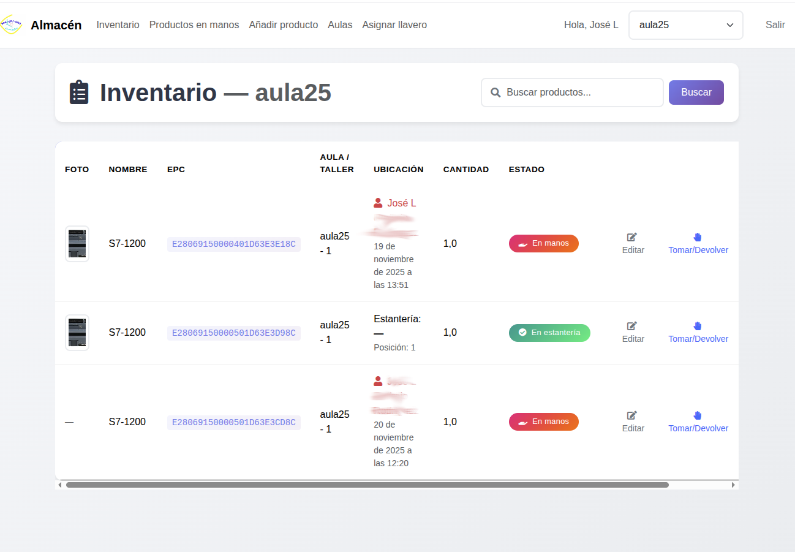
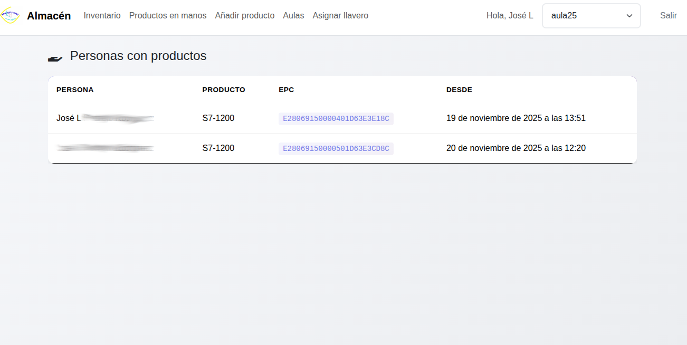
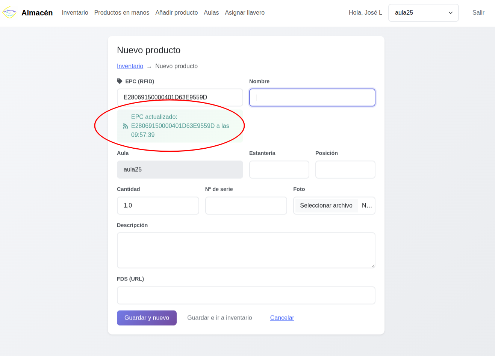
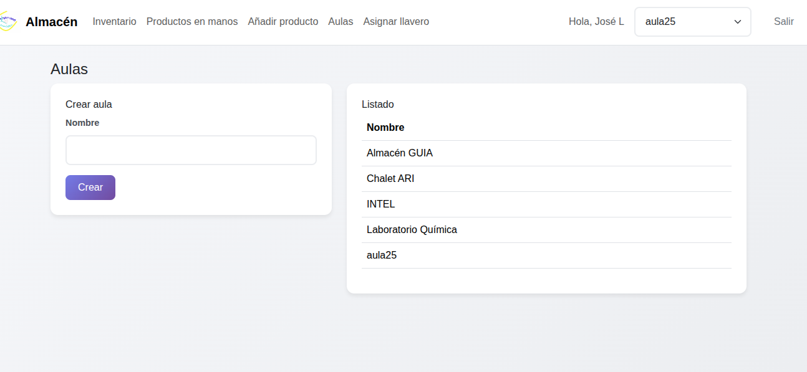
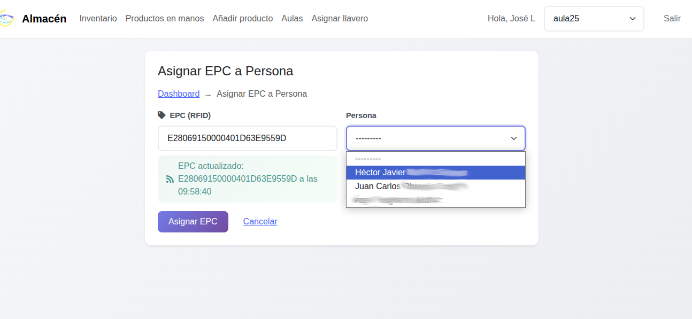

 

## 1. Introducción {#introduccion}

### 1.1 ¿Qué es el Sistema de Almacén Inteligente? {#que-es-el-sistema}

El Sistema de Almacén Inteligente es una aplicación web desarrollada para la gestión automatizada del inventario en aulas de Formación Profesional del I.E.S. Santiago Apóstol. Utiliza tecnología RFID (Identificación por Radiofrecuencia) para realizar un seguimiento en tiempo real de los materiales, herramientas y componentes del aula.

### 1.2 Objetivos del Sistema

- **Digitalización del inventario**: Control automatizado de todos los elementos del aula
- **Control de acceso por aulas**: Los usuarios solo pueden acceder a los productos de las aulas autorizadas
- **Trazabilidad completa**: Registro de quién toma y devuelve cada producto
- **Acceso web**: Consulta del inventario desde cualquier dispositivo conectado a la red del centro
- **Reducción de errores**: Eliminación del registro manual y sus errores asociados
- **Sostenibilidad**: Optimización en el uso de recursos y reducción de pérdidas

### 1.3 Tecnología Utilizada {#tecnologia-utilizada}

El sistema se basa en:

- **Etiquetas RFID pasivas UHF** adheridas a cada elemento del inventario
- **Lectores RFID** instalados estratégicamente en el aula
- **Servidor basado en Raspberry Pi** que ejecuta la aplicación Django
- **Aplicación web responsive** accesible desde ordenadores, tablets y móviles
- **Integración con Google Workspace** la autenticación segura se realiza usando cuentas del centro educativo

---

## 2. Primeros Pasos

### 2.1 Acceso al Sistema

1. Abre tu navegador web (Chrome, Firefox, Safari, Edge)

2. Accede a la dirección proporcionada por tu centro. En el IES Santiago Apóstol es: `http://fp.santiagoapostol.net`

3. Verás la pantalla de inicio de sesión
   
   

### 2.2 Inicio de Sesión {#inicio-sesion}

El sistema utiliza autenticación mediante Google Workspace del centro educativo:

1. En la pantalla de inicio de sesión, haz clic en el botón **"Entrar con el correo del instituto"**
2. Introduce tu correo electrónico del dominio **@santiagoapostol.net**
3. Introduce tu contraseña de ese correo si no lo tienes abierto. Si lo tienes abierto te dejará seleccionarlo y te pedirá confirmar el acceso la primera vez.
4. El sistema te redirigirá automáticamente al panel principal

> **Nota**: Solo los usuarios con cuentas del dominio del centro pueden acceder al sistema.

### 2.3 Tipos de Usuario

El sistema distingue tres tipos de usuarios:

| Tipo de Usuario             | Permisos      | Funciones                                                                                                                            |
|:---------------------------:|:-------------:|:------------------------------------------------------------------------------------------------------------------------------------:|
| **Alumno**                  | Básico        | Ver inventario, tomar/devolver productos de sus aulas asignadas                                                                      |
| **Profesor**                | Estándar      | Ver inventario, tomar/devolver productos, gestionar su aula. Crear/editar/eliminar productos, gestionar aulas, asignar llaveros RFID |
| **Administrador del sitio** | Administrador | Todas las anteriores y además asigna los permisos a los profesores.                                                                  |

---

## 3. Interfaz Principal

### 3.1 Barra de Navegación {#barra-de-navegacion}

La barra superior contiene los siguientes elementos:

- **Logo y "Almacén"**: Enlace al panel principal
- **Inventario**: Acceso a la lista completa de productos
- **Productos en manos**: Ver qué productos están actualmente prestados
- **Añadir producto** (solo profesores): Crear nuevos productos
- **Aulas** (solo profesores): Gestionar las aulas del centro
- **Asignar llavero** (solo profesores): Asignar tarjetas RFID a personas
- **Selector de Aula**: Desplegable para filtrar por aula
- **Nombre de usuario**: Muestra tu nombre
- **Botón Salir**: Cerrar sesión

### 3.2 Panel Principal (Dashboard)

Al entrar, verás tres tarjetas con estadísticas:

1. **Productos**: Total de productos en el inventario
2. **En estantería**: Productos disponibles en sus ubicaciones
3. **En manos**: Productos actualmente prestados

Debajo aparece una tabla con los **productos añadidos recientemente**.

### 3.3 Selector de Aula {#selector-de-aula}

El selector de aula en la barra de navegación permite:

- Ver productos de un aula específica
- Ver productos de todas las aulas (opción "— Todas las aulas —")
- Solo se muestran las aulas a las que tienes acceso

> **Importante**: El sistema recordará tu última selección de aula.

---

## 4. Gestión del Inventario {#gestion-del-inventario}

### 4.1 Ver el Inventario

1. Haz clic en **"Inventario"** en la barra de navegación

2. Verás una tabla (en ordenador) o tarjetas (en móvil) con todos los productos

3. Cada producto muestra:
   
   - Foto (si está disponible)
   
   - Nombre del producto
   
   - Código EPC (etiqueta RFID)
   
   - Aula/Taller
   
   - Ubicación (estantería y posición)
   
   - Cantidad
   
   - Estado (En estantería / En manos)
     
     

### 4.2 Buscar Productos

En la parte superior del inventario hay una barra de búsqueda:

1. Escribe en el campo de búsqueda
2. Puedes buscar por:
   - Nombre del producto
   - Código EPC
   - Número de serie
   - Descripción
3. Haz clic en **"Buscar"**
4. Los resultados se actualizarán automáticamente

### 4.3 Estados de los Productos

Los productos pueden tener tres estados:

- 🟢 **En estantería**: Disponible en su ubicación habitual
- 🔴 **En manos**: Alguien lo ha tomado prestado
- ⚪ **Desconocido**: No se ha registrado ubicación

---

## 5. Tomar y Devolver Productos {#tomar-y-devolver-productos}

### 5.1 Método Automático (con Lector RFID) {#metodo-automatico}

Este es el método principal y recomendado:

#### Para TOMAR un producto:

1. Asegúrate de tener tu **tarjeta/llavero RFID personal**
2. Acércate al lector RFID del aula
3. Pasa tu tarjeta personal por el lector
4. Pasa el producto que quieres tomar por el lector
5. El sistema registrará automáticamente que has tomado el producto

#### Para DEVOLVER un producto:

1. Acércate al lector RFID del aula
2. Pasa tu tarjeta personal por el lector
3. Pasa el producto que vas a devolver por el lector
4. El sistema registrará automáticamente la devolución

> **Importante**: Siempre debes pasar primero tu tarjeta personal y luego los productos en un intervalo de pocos segundos.

> **Nota**: El administrador de la aplicación puede activar un modo de trabajo en el que no sea necesario pasar el llavero. Por defecto, el llavero personal **ES NECESARIO**.

### 5.2 Método Manual (desde la Aplicación) {#metodo-manual}

Si el lector RFID no está disponible:

1. Accede al **Inventario**
2. Localiza el producto que quieres tomar o devolver
3. Haz clic en el botón **"Tomar/Devolver"**
4. Confirma la acción en el cuadro de diálogo
5. El sistema actualizará el estado del producto

### 5.3 Confirmaciones

Al realizar cualquier acción, el sistema mostrará un mensaje de confirmación:

- ✅ "Has tomado el producto" (color verde)
- ✅ "Producto devuelto al estante" (color verde)
- ❌ Mensaje de error si algo falla (color rojo)

---

## 6. Consultar Productos en Manos {#consultar-productos-en-manos}

### 6.1 Vista General

1. Haz clic en **"Productos en manos"** en el menú

2. Verás una lista de todos los productos actualmente prestados

3. La información incluye:
   
   - Persona que tiene el producto
   
   - Nombre del producto
   
   - Código EPC
   
   - Fecha y hora en que se tomó
     
     

### 6.2 Interpretación {#interpretacion}

- Si tienes productos en tu nombre, verás cuánto tiempo los has tenido
- Los profesores pueden ver todos los productos prestados
- Útil para saber quién tiene qué material antes de necesitarlo

---

## 7. Funciones para Profesores {#funciones-para-profesores}

### 7.1 Añadir un Nuevo Producto {#anadir-producto}

Solo los profesores del grupo "ProfesoresFP" pueden añadir productos:

1. Haz clic en **"Añadir producto"** en el menú
2. Rellena el formulario con los siguientes datos:

#### Campos obligatorios:

> **Truco**: El campo EPC se actualiza automáticamente cada 5 segundos si hay lecturas recientes del lector RFID. Por tanto, si pasas el producto con su etiqueta por el lector, se rellenará el EPC automáticamente

- **EPC (RFID)**: Código de la etiqueta RFID
  - Puedes escribirlo manualmente
  - O pasar el producto por el lector (se rellena automáticamente)
- **Nombre**: Denominación del producto

#### Campos opcionales:

- **Aula**: Se selecciona automáticamente según tu aula actual

- **Estantería**: Ubicación física (ej: "A1", "Estante 3")

- **Posición**: Posición específica (ej: "Fila 2, Columna 3") o, si hay varios productos iguales, el  número 1, el número 2, etc. A criterio del profesor.

- **Cantidad**: Por defecto 1.0 (puedes usar decimales)

- **Nº de serie**: Número de serie del fabricante

- **Foto**: Imagen del producto (formatos: JPG, PNG)

- **Descripción**: Información adicional

- **FDS (URL)**: Enlace a la ficha de datos de seguridad
3. Haz clic en uno de los dos botones:
   - **"Guardar y nuevo"**: Guarda el producto y abre un formulario vacío para añadir otro
   - **"Guardar e ir a inventario"**: Guarda el producto y vuelve al listado

### 7.2 Editar un Producto

1. Ve al **Inventario**
2. Localiza el producto que quieres editar
3. Haz clic en el botón **"Editar"** (icono de lápiz)
4. Modifica los campos necesarios
5. Haz clic en **"Guardar e ir a inventario"**

> **Nota**: El campo EPC no se puede modificar al editar un producto existente.

### 7.3 Eliminar un Producto

1. Ve al **Inventario**
2. Localiza el producto que quieres eliminar
3. Haz clic en el botón **"Eliminar"** (icono de papelera)
4. Confirma la eliminación en el cuadro de diálogo
5. El producto se eliminará de forma permanente

> **Advertencia**: Esta acción no se puede deshacer. Se eliminará el producto y todo su historial de préstamos.

### 7.4 Gestionar Aulas {#gestionar-aulas}

1. Haz clic en **"Aulas"** en el menú
2. Verás dos secciones:
   - **Crear aula**: Formulario para añadir nuevas aulas
   - **Listado**: Tabla con todas las aulas existentes

#### Para crear una nueva aula:

1. Escribe el nombre del aula en el campo "Nombre"
2. Haz clic en **"Crear"**
3. El aula se añadirá a la lista

### 7.5 Asignar Llaveros/Tarjetas RFID a Personas {#asignar-llaveros}

Los profesores pueden asignar tarjetas RFID personales a usuarios:

1. Haz clic en **"Asignar llavero"** en el menú
2. Pasa la tarjeta/llavero RFID por el lector
   - El código EPC se rellenará automáticamente
3. Selecciona la persona en el desplegable **"Persona"**
4. Haz clic en **"Asignar EPC"**

> **Importante**: Cada persona solo puede tener una tarjeta RFID asignada. Solo aparecen en el listado las personas que aún no tienen tarjeta asignada.

---

## 8. Uso en Dispositivos Móviles {#uso-en-dispositivos-moviles}

### 8.1 Diseño Responsive {#diseno-responsive}

La aplicación está optimizada para móviles y tablets:

- Los menús se adaptan a pantallas pequeñas
- Las tablas se convierten en tarjetas fáciles de leer
- Los botones son táctiles y de tamaño adecuado

### 8.2 Vista en Móvil {#vista-en-movil}

En móviles, el inventario se muestra como tarjetas que incluyen:

- Foto del producto (si existe)
- Nombre y número de serie
- Badge de estado (En estantería / En manos)
- Detalles de ubicación
- Botones de acción expandidos

### 8.3 Funcionalidad Completa {#funcionalidad-completa}

Todas las funciones están disponibles en móvil:

- Consultar inventario
- Buscar productos
- Tomar y devolver (manualmente)
- Ver productos en manos

---

## 9. Preguntas Frecuentes (FAQ) {#preguntas-frecuentes}

### 9.1 Acceso y Autenticación {#acceso-y-autenticacion}

**P: ¿Por qué no puedo iniciar sesión?** R: Asegúrate de usar tu correo del dominio @santiagoapostol.net. Si el problema persiste, contacta con el coordinador TIC del centro.

**P: ¿Puedo usar mi cuenta personal de Google?** R: No, solo funcionan las cuentas del Google Workspace del centro educativo.

**P: He olvidado mi contraseña** R: Usa el sistema de recuperación de contraseña de Google Workspace del centro o contacta con el administrador.

### 9.2 Gestión de Productos {#gestion-de-productos}

**P: ¿Puedo tomar varios productos a la vez?** R: Sí, con el lector RFID. Pasa tu tarjeta personal y luego todos los productos que necesites en los siguientes segundos.

**P: ¿Qué hago si el lector RFID no funciona?** R: Puedes usar el método manual desde la aplicación web usando el botón "Tomar/Devolver" en cada producto.

**P: ¿Puedo devolver productos de otra persona?** R: Los profesores sí pueden devolver cualquier producto. Los alumnos solo pueden devolver sus propios productos.

**P: No encuentro un producto en el inventario** R: Usa la barra de búsqueda. Si aún no lo encuentras, puede que esté registrado en otra aula o que no haya sido añadido al sistema.

### 9.3 Lector RFID {#lector-rfid-faq}

**P: ¿A qué distancia funciona el lector RFID?** R: Los lectores UHF suelen funcionar entre 1 y 5 metros, dependiendo del modelo y la potencia configurada.

**P: ¿Qué hago si mi tarjeta personal no se detecta?** R: Contacta con un profesor del grupo ProfesoresFP para que te asigne una nueva tarjeta.

**P: ¿Puedo usar mi móvil como tarjeta RFID?** R: No, el sistema usa tecnología RFID UHF pasiva que no es compatible con los móviles (que usan NFC).

### 9.4 Permisos y Aulas {#permisos-y-aulas}

**P: ¿Por qué no veo todos los productos?** R: Los usuarios no administradores solo ven productos de las aulas a las que tienen acceso asignado.

**P: ¿Cómo puedo acceder a otra aula?** R: Contacta con un profesor del grupo ProfesoresFP para que te añada a las aulas correspondientes.

**P: ¿Puedo cambiar de aula?** R: Usa el selector de aula en la barra de navegación para cambiar entre las aulas a las que tienes acceso.

### 9.5 Problemas Técnicos {#problemas-tecnicos}

**P: No accedo a la página de la aplicación** R: La aplicación sólo es visible **DENTRO DE LA RED DEL INSTITUTO**. Para poder acceder debes estar conectado por cable, o si usas wifi, conectado a la wifi *educarex*. Otras redes wifi como *educarexINV* **no** están conectadas al centro y, por tanto, no dan acceso a la aplicación

**P: No se guardan mis cambios** R: Asegúrate de hacer clic en "Guardar" y espera el mensaje de confirmación. Si no aparece, vuelve a intentarlo.

**P: ¿Qué hago si veo un error en la aplicación?** R: Toma nota del mensaje de error y contacta con el coordinador del proyecto. Si es posible, haz una captura de pantalla.

---

## 10. Buenas Prácticas {#buenas-practicas}

### 10.1 Para Alumnos

✅ **Hacer**:

- Pasar siempre tu tarjeta personal antes de tomar productos
- Devolver los productos cuando termines de usarlos
- Comprobar el estado del producto antes de tomarlo
- Informar si encuentras un producto dañado o mal ubicado

❌ **Evitar**:

- Tomar productos sin registrarlos
- Dejar productos fuera de su ubicación sin devolverlos en el sistema
- Compartir tu tarjeta RFID personal

### 10.2 Para Profesores {#para-profesores-bp}

✅ **Hacer**:

- Mantener actualizada la información de los productos
- Añadir fotos a los productos para facilitar su identificación
- Verificar periódicamente los productos que llevan mucho tiempo prestados
- Formar a los alumnos en el uso correcto del sistema

❌ **Evitar**:

- Eliminar productos sin verificar su estado
- Crear productos duplicados (verificar primero si existe)
- Modificar la ubicación de productos sin actualizar el sistema

### 10.3 Mantenimiento del Inventario {#mantenimiento-inventario}

- **Revisiones periódicas**: Comprobar que la ubicación física coincide con la registrada
- **Limpieza de registros**: Eliminar productos obsoletos o dados de baja
- **Actualización de fotos**: Mantener imágenes actualizadas de los productos
- **Verificación de préstamos**: Contactar con usuarios que tienen productos durante mucho tiempo

---

## 11. Solución de Problemas {#solucion-de-problemas}

### 11.1 Problemas Comunes y Soluciones {#problemas-y-soluciones}

| Problema                               | Posible Causa                       | Solución                                       |
| -------------------------------------- | ----------------------------------- | ---------------------------------------------- |
| No puedo iniciar sesión                | Cuenta no autorizada                | Usar correo @santiagoapostol.net               |
| El lector RFID no detecta mi tarjeta   | Tarjeta no asignada o dañada        | Contactar con profesor para nueva asignación   |
| No veo el botón "Añadir producto"      | No perteneces al grupo ProfesoresFP | Solicitar permisos al coordinador              |
| El inventario está vacío               | Filtro de aula activo o sin acceso  | Cambiar a "Todas las aulas" o solicitar acceso |
| No se actualizan los cambios           | Problema de conexión                | Refrescar la página (F5)                       |
| Mensaje "No tienes acceso a esta aula" | Falta de permisos                   | Solicitar acceso al profesor                   |

## 12. Glosario de Términos {#glosario-de-terminos}

- **RFID**: Radio Frequency Identification (Identificación por Radiofrecuencia)
- **EPC**: Electronic Product Code (Código Electrónico de Producto)
- **UHF**: Ultra High Frequency (Ultra Alta Frecuencia), tipo de RFID de largo alcance
- **Lector RFID**: Dispositivo que detecta las etiquetas RFID
- **Etiqueta/Tag RFID**: Pequeño chip con antena adherido a cada producto
- **Prestamo**: Registro de cuando alguien toma un producto
- **Ubicación**: Estado y posición física de un producto (En estantería / En manos)
- **Aula**: Espacio físico del centro (laboratorio, taller, aula) donde se almacenan productos
- **Dashboard**: Panel principal con resumen de estadísticas
- **Llavero/Tarjeta RFID**: Dispositivo personal asignado a cada usuario para identificarse

---

## 13. Aspectos de Seguridad y Privacidad {#seguridad-y-privacidad}

### 13.1 Protección de Datos {#proteccion-de-datos}

El sistema cumple con la normativa de protección de datos:

- Solo se almacena información necesaria para la gestión del inventario
- Los datos personales están protegidos con autenticación
- El historial de préstamos es visible solo para personal autorizado

### 13.2 Responsabilidades del Usuario {#responsabilidades-usuario}

- Mantener tu contraseña segura
- No compartir tu tarjeta RFID personal
- Informar inmediatamente si pierdes tu tarjeta
- Usar el sistema solo para fines educativos

---

## 14. Objetivos de Desarrollo Sostenible {#ods}

Este proyecto contribuye a los siguientes ODS de la Agenda 2030:

- **ODS 9**: Industria, innovación e infraestructura - mediante la implementación de tecnología RFID
- **ODS 12**: Producción y consumo responsables - optimizando el uso de recursos y reduciendo pérdidas
- **ODS 17**: Alianzas para lograr los objetivos - colaboración entre centro educativo y empresa

---

## 15. Anexos {#anexos}

### 15.1 Atajos de Teclado

| Atajo    | Acción                             |
| -------- | ---------------------------------- |
| F5       | Recargar página                    |
| Ctrl + F | Buscar en página                   |
| Tab      | Navegar entre campos de formulario |

### 15.2 Códigos de Estado HTTP {#codigos-de-estado-http}

Si ves un error con código numérico:

- **403**: No tienes permiso para acceder a ese recurso
- **404**: Página o producto no encontrado
- **500**: Error del servidor, contacta con soporte

---

## 16. Agradecimientos {#agradecimientos}

Este proyecto ha sido desarrollado como parte del **Proyecto de Innovación de FP** del I.E.S. Santiago Apóstol en colaboración con:

- **Departamento de Electricidad y Electrónica**
- **Departamento de Actividades Físicas y Deportivas**
- **Departamento de Química**
- **Empresa colaboradora**: Sistemas de seguridad Fuenteroniel (Segurprex)
- **Centro colaborador**: IES Extremadura de Montijo

**Participantes**:

- CFGS Automatización y Robótica Industrial
- CFGM Instalaciones de Telecomunicaciones
- CFGM Guía en el Medio Natural y Tiempo Libre
- CFGS Laboratorio de Análisis y Control de Calidad

---

2025 *Proyecto de Innovación aplicada y transferencia de conocimiento* 

